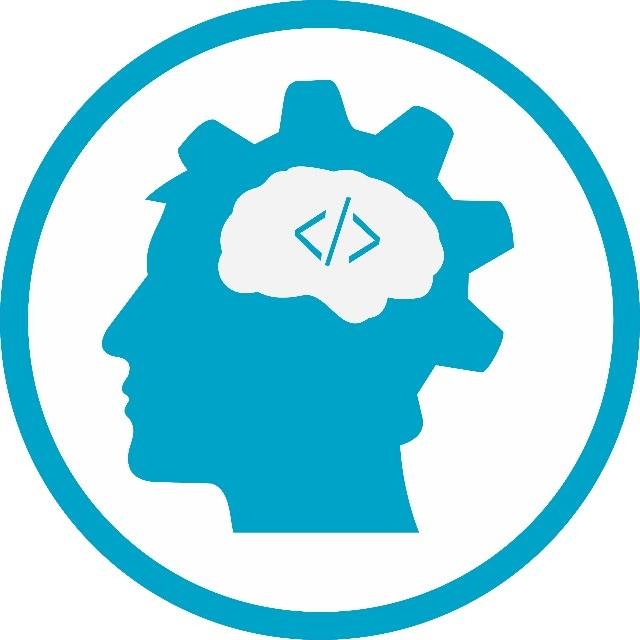

# teste-fabrica
readme-teste. não sei mexer
## 🚀 Iniciando
# Finalidade:
 Ajuda o projeto ter mais relevância e deixa as pessoas mais curiosas para ler o código, trazendo assim, mais visibilidade.
# Um Readme possui:
* Logo
* Título
* Descrição
* Status do prjeto
* Features
* Pré-requisitos
* Licença

### Trabalhando com links

##### https://www.univs.edu.br/ - Site
##### https://www.youtube.com/channel/UCeZoaMjKTM9qkbf7FvlRkJw - Youtube

<h1 align="center">
  
</h1>

 
# Mais Informações💬: 
sem informações

<h1 align="left">
  
</h1>
